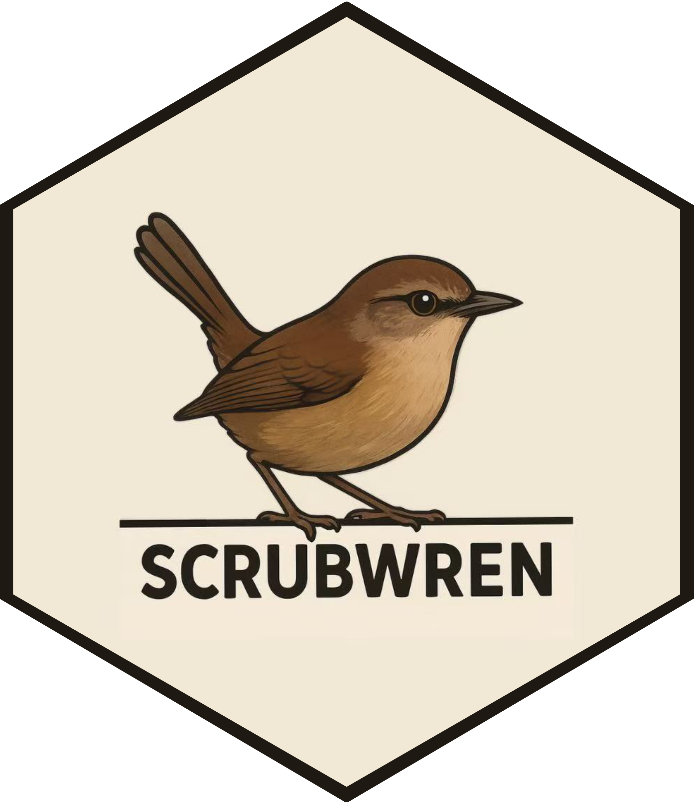

<!-- README.md is generated from README.Rmd. Please edit that file -->

```{r, include = FALSE}
knitr::opts_chunk$set(
  collapse = TRUE,
  comment = "#>",
  fig.path = "man/figures/README-",
  out.width = "100%"
)
```

# scrubwren 

<!-- badges: start -->
<!-- badges: end -->

Specialized Collection of Reticulate Utilities: Better WRappers for a smoother ExperieNce

## Installation

You can install the development version of scrubwren from [GitHub](https://github.com/) with:

``` r
# install.packages("remotes")
remotes::install_github("TengMCing/scrubwren")
```

## `reticulate` utilities

```{r}
library(scrubwren)
```


## Python class definition: `py_class()`

In `reticulate`, Python class definitions must be provided as a list via the `defs` argument in `PyClass`. With `py_class()`, you can instead supply them as regular function arguments. You can still specify `classname` as a character string and `inherit` as a list of Python objects, as usual. 

However, `PyClass` does not allow you to disable automatic conversion of Python objects to R, which means that any method defined in the class will return an R object whenever possible. This can be frustrating for data analysis tasks that rely on object indexing, since R starts at 1 while Python starts at 0. The `py_class` function lets you control this behavior through the `convert` argument.


```{r}
Employee <- py_class("Employee", convert = FALSE,
                     `__init__` = function(self, name, id) {
                       self$name <- name
                       self$id <- id
                       return(invisible(NULL))
                     },
                     get_email = function(self) {
                       paste0(self$name, "_", self$id, "@company.com")
                     })
Mike <- Employee("Mike", "1234")
Mike$get_email()
Mike$get_email() |> class()
```


## Turning automatic conversion on/off with `py_convert_on()` / `py_convert_off()`

`py_convert_on()` enables automatic conversion of Python objects to R, while `py_convert_off()` disables it. Note that the Python object must also be represented as an R environment for this to work, this typically includes Python modules or object instances, but not Python classes.

```{r}
Mike$get_email() |> class()

py_convert_on(Mike)
Mike$get_email() |> class()

py_convert_off(Mike)
Mike$get_email() |> class()
```
